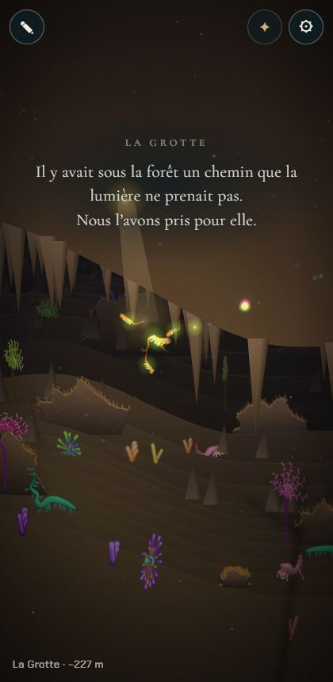
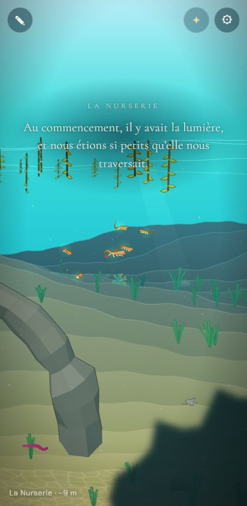
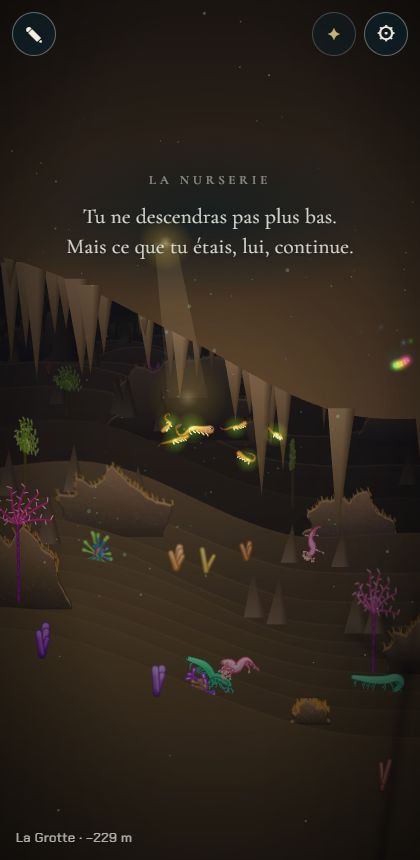
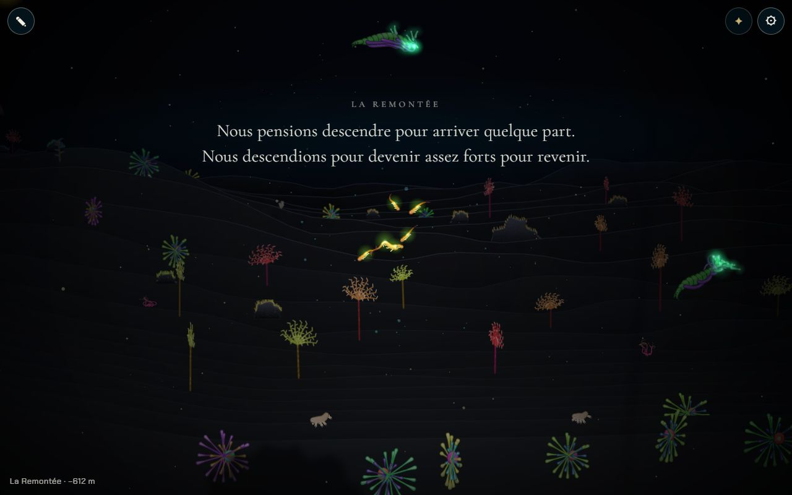

# Les textes narratifs : ouvertures et adieux

## Livré

- **Les textes viennent de `docs/chapitres.md`** : `src/monde/textes.ts` lit le document (importé en `?raw`, donc inclus dans le fichier unique) et en tire, pour chaque `## N. Nom`, la citation qui suit « Ouverture : », « Adieu … : », « Le retournement : » (ouverture de la Remontée) ou « Texte final : ». Aucun texte dans le code : on les change en écrivant dans le doc.
- **Mise en lignes** (`toLines`) : une phrase par ligne, apostrophes typographiques, une phrase seule et longue coupée à la virgule la plus proche du milieu, 4 lignes au plus. Temps de lecture (`holdTime`) selon la longueur.
- **Affichage** (`src/monde/narration.ts`, CSS dans `style.css`) : Cormorant Garamond 300 (graisse ajoutée au lien Google Fonts de `index.html`), le nom du chapitre en petites capitales espacées au-dessus, puis chaque ligne apparaît lentement (fondu + léger flou qui se dissipe, 1,7 s d'écart), reste, puis tout s'efface. Un halo sombre très doux garde le texte lisible dans l'eau claire de la Nurserie.
- **Quand** : l'ouverture, la première fois qu'on entre dans un chapitre (y compris par le Voyage de ⚙, réservé à `?dev` depuis `monde-fini-debut`, ou `monde.gotoBiome`) ; en y revenant, seul le nom passe. Si le panneau des Nouveautés ou l'Atelier couvre la mer, l'ouverture attend qu'il se ferme.
- **Adieu** : prêt mais sans déclencheur (le jeu n'a pas encore de générations) : `monde.narrator.tell(i, 'farewell')` (ou `'final'`). Seuls la Nurserie et la Grotte ont un adieu dans le doc.
- `showChapter` (`main.ts`) ne fait plus qu'appeler le narrateur ; `narrator` est exposé dans `window.monde`.
- Tests : `src/monde/textes.test.ts` (chaque chapitre de la carte a son ouverture dans le doc, 2 à 4 lignes partout, adieux, retournement, texte final, coupures).

Pour voir : lancer le jeu, attendre l'ouverture de la Nurserie ; avec `?dev`, ⚙ Voyage vers un autre chapitre ; dans la console, `monde.narrator.tell(0, 'farewell')`.

## Choix retenus

Aucune question posée à l'utilisateur ; tout est tranché seul (option recommandée).

| Question | Choix retenu | Pourquoi |
| --- | --- | --- |
| Où vivent les textes | lus dans `docs/chapitres.md` (import `?raw` + analyse) | une seule source, celle que le chantier désigne ; l'auteur écrit dans le doc |
| Garder le nom du chapitre | oui, petit, en capitales espacées, au-dessus des lignes | on sait toujours où l'on est, sans voler la place au texte |
| Revenir dans un chapitre | seul le nom passe | l'ouverture garde sa force, le voyage reste lisible |
| Coupure des lignes | une phrase par ligne, coupe à la virgule pour une phrase seule longue | respecte « deux à quatre lignes » sans balisage dans le doc |
| Apparition | ligne par ligne, fondu + flou qui se dissipe | « apparition lente », sans animation lettre à lettre coûteuse |
| Déclencheur de l'adieu | API seule (`narrator.tell`) | il n'y a pas encore de fin de génération dans le jeu |
| Panneaux ouverts | l'ouverture attend leur fermeture | ne pas raconter sous le panneau des Nouveautés |
| Remontée | « Le retournement » = son ouverture, « Texte final » = type `final` | suit la structure du doc |

## Options non retenues

- **Où vivent les textes** : module TS `textes-data.ts` recopié du doc (plus léger dans le build, mais deux sources à tenir) ; fichier JSON/YAML dédié (propre, mais le doc cesserait d'être la source) ; plugin Vite qui n'extrait que les citations (évite d'inclure tout le doc, ~15 Ko, dans le fichier unique ; plus de code de build).
- **Nom du chapitre** : le supprimer (plus pur, mais on perd le repère pendant le voyage) ; le garder en grand comme avant (contredit « lettres fines »).
- **Revenir** : rejouer l'ouverture à chaque entrée (lassant) ; rien du tout (on perd le repère).
- **Coupure** : balisage explicite des lignes dans le doc (contrôle total, mais alourdit le doc) ; laisser le navigateur couper (lignes inégales).
- **Apparition** : lettre à lettre (plus « machine à écrire », moins doux, plus de nœuds DOM) ; tout le bloc d'un coup (moins de lenteur).
- **Adieu** : le déclencher en jouant une autre espèce dans l'Atelier (`becomes`) (faux sens : l'Atelier est hors de l'histoire) ; à chaque sortie de chapitre (ce n'est pas un adieu de génération).
- **Panneaux** : cacher le texte pendant qu'un panneau est ouvert puis le reprendre (plus fin, plus de code).
- **Mémoire des ouvertures dites** : la sauvegarder (dépend du chantier `sauvegarde-automatique`) ; pour l'instant, elle dure la session.

## Reste à faire / limites

- Brancher l'adieu sur la fin d'une génération quand elle existera, et le texte final sur la fin de la Remontée.
- Écrire les adieux des chapitres 2 à 9 dans `chapitres.md` (le test n'exige que les ouvertures).
- `narrator.told` n'est pas sauvegardé : à brancher sur la sauvegarde automatique pour ne pas rejouer les ouvertures à chaque visite.
- Au tout premier lancement après une nouvelle version, le panneau des Nouveautés s'ouvre à 1,8 s, par-dessus l'ouverture de la Nurserie déjà commencée (l'ouverture n'attend que si le panneau est ouvert avant).
- Le champ `sub` des biomes n'est plus affiché.
- Le fichier unique embarque tout `chapitres.md` (~15 Ko de texte).

- Depuis les bornes du monde (`monde-fini-debut`, fusionné), le monde s'arrête au fond de la Fosse : l'ouverture de la Remontée (« le retournement ») ne se lit plus en jouant, seulement en voyageant (`?dev`). Elle reviendra quand franchir la Fosse ouvrira la Remontée.

## Fusion avec `backlog` (après `monde-fini-debut`)

- Conflit unique : `src/monde/main.ts`, la ligne de l'objet `api` ; les deux côtés gardés (`narrator` et `limits`, `bounds`).
- Sans conflit : `docs/chapitres.md` (« Les bornes du monde » et mon point dans « Les textes » cohabitent), `index.html` (le lien des polices et la consigne raccourcie). Revérifié : l'ouverture de la Nurserie s'affiche toujours au départ, à la surface.

## Risques de fusion

- `src/monde/main.ts` : import de `createNarrator`, `showChapter` réduit à une ligne (le corps d'avant supprimé), `narrator` dans l'objet `api`, et `initNouveautes(...)` désormais affecté à `const nouveautes` suivi de `narrator.quiet = …`. Conflit probable avec `transitions-entre` s'il touche `showChapter`.
- `src/monde/style.css` : règles `#chapter` remplacées (`strong`/`span` → `small`/`p`).
- `index.html` : graisse 300 ajoutée au lien Cormorant Garamond.
- `docs/chapitres.md` : un point ajouté dans « Les textes » ; le format des citations sous « Ouverture : » est désormais lu par le jeu (le test le garde).
