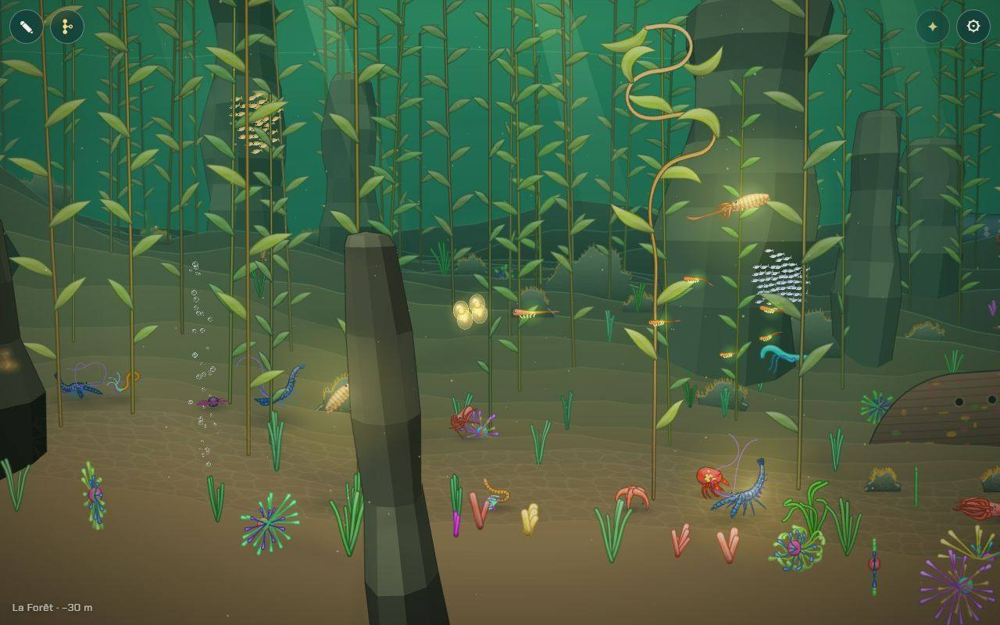
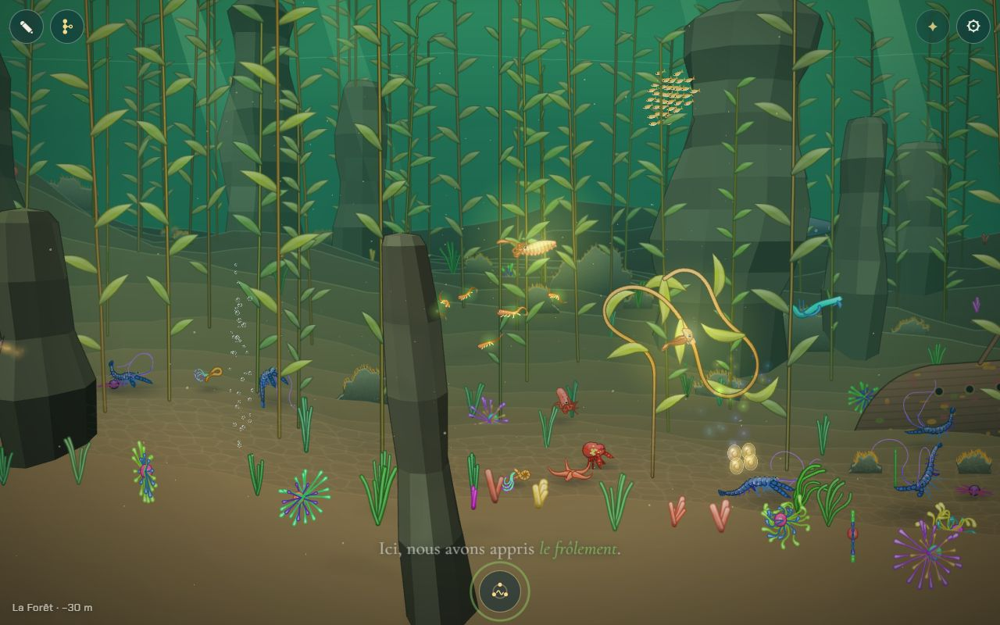
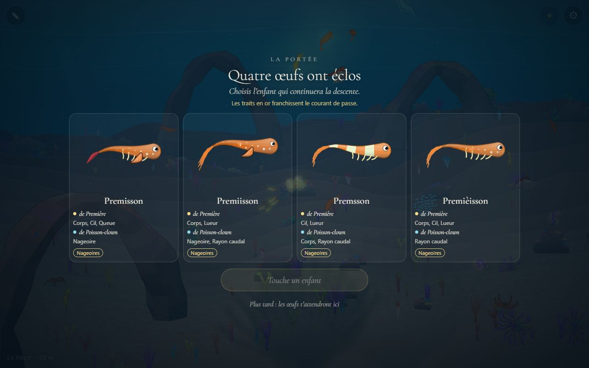
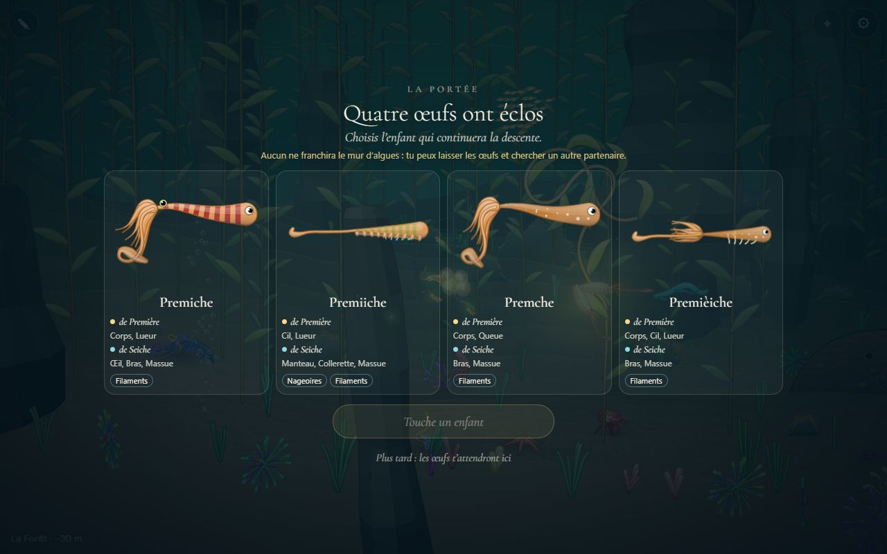
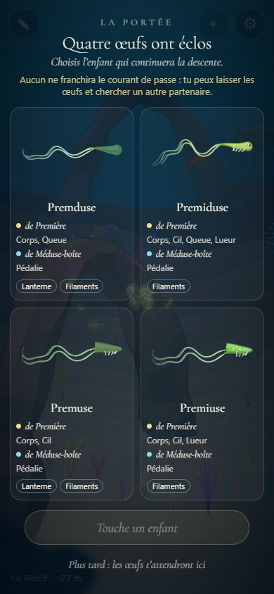
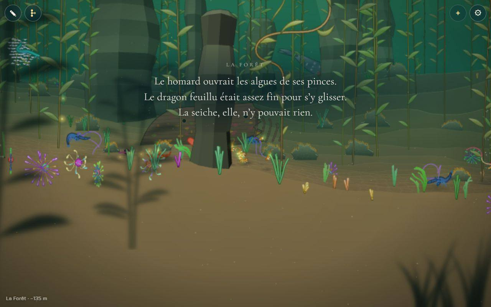
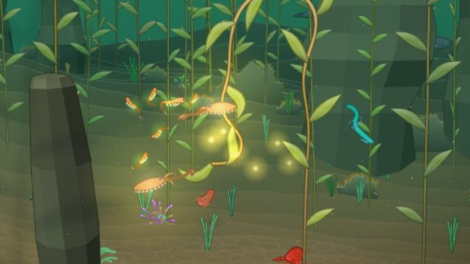

# Titre du chantier : plus rien d'imposé (la ponte, « Plus tard » et les indices)

Le chantier : « le forçage pour passer dans un mode est intrusif, pas smooth ; on est obligé d'accepter un œuf ; diriger le joueur plus ; même s'il refuse, il doit encore s'accoupler ; lui donner des indices pour trouver la bonne bestiole ».

Avant : rester 1,2 s près d'un partenaire lançait la parade ; s'en aller ne l'arrêtait pas (le partenaire nous attendait) ; 20 s plus tard, la portée recouvrait la mer où qu'on soit, sans autre sortie que choisir un enfant. Rien ne disait quel partenaire aurait fait passer l'obstacle.

## Livré

- **La parade se quitte** (`parade.ts`, `parade-jeu.ts`) : à plus de 520 du partenaire pendant 2,5 s (`LEAVE_FAR`, `LEAVE_TIME`, `away`), il nous laisse partir avec quelques lueurs : pas d'œufs, rien qui s'ouvre plus tard. La danse ne l'écarte jamais de plus de 480 de nous, donc suivre de loin ne compte pas pour un départ. Le partenaire nous remarque après **2 s** près de lui (au lieu de 1,2) : le frôler en passant ne suffit plus. Un voyage de test en pleine parade la quitte au lieu de la finir. `monde.parade.leave()`.
- **La ponte** (`ponte.ts` pur et testé, `ponte-jeu.ts`) : à la fin d'une parade, quatre œufs d'or pâle (ceux de l'écran de la portée) sont pondus dans la figure de lumière qui ferme la danse, entre les deux danseurs (`ParadeResult.at`). Rester près d'eux (110, 1,6 s, après les 1,6 s de la figure) : ils tremblent et brillent de plus en plus, puis la portée s'ouvre. S'en aller : rien ne s'ouvre. Une ponte à la fois ; choisir un enfant la fait éclore. `monde.ponte`.

  
  

- **« Plus tard »** (`portee-ecran.ts`, `portee.css`) : second bouton de la portée, « Plus tard : les œufs t'attendront ici » (ou Échap, `portee.later()`). Les œufs restent ; pour rouvrir, s'en éloigner (180) puis revenir près d'eux : ce sont les mêmes quatre enfants (la graine de `brood` est gardée). Vérifié en jeu : même noms à la réouverture, puis choix, adieu, œufs effacés.
- **La portée dit ce qui passe** (`broodNote`) : « Les traits en or franchissent le mur d'algues. », ou « Aucun ne franchira le mur d'algues : tu peux laisser les œufs et chercher un autre partenaire. »

  
  
  

- **Les indices** (`indices.ts` pur et testé, `indices-jeu.ts`) :
  - ils s'éveillent quand l'obstacle du chapitre nous retient (là où il dit ses mots), ou quand on laisse pour plus tard une portée dont aucun enfant ne passerait ; ils se taisent quand le corps joué franchit ;
  - **les mots** : en ressortant de la portée de l'obstacle, la lignée dit qui avait ce qu'il fallait, la citation « L'indice (proposition) : » de chaque chapitre à obstacle, écrite dans `docs/chapitres.md` (nouveau `TextKind` `hint` dans `textes.ts`) ;
  - **le fil de lumière** : toutes les 3,4 s, huit lueurs dorées (l'or des partenaires) partent du nageur vers le partenaire le plus proche qui ferait l'affaire, ou vers nos œufs s'ils n'ont pas été ouverts ou si un enfant passerait ; à moins de 420, le fil s'arrête et ce partenaire appelle (deux lueurs montent de lui).
  - **le bon partenaire** : noté par quatre portées d'essai avec la créature jouée (`SAMPLE`, `broodCrosses`, `bestPartners`), calculées une par pas de jeu (1 à 3 ms) ; en attendant, ceux qui ont le trait. À la Grotte, avec la larve, le fil mène au serpent cilié et au cténophore, pas à l'anguille (vérifié en jeu, `monde.indices.right('grotte')`).

  
  

- **Les obstacles lisent les vrais traits** (`obstacles-jeu.ts`) : `traitsOf` de `content/traits.ts`, comme la portée et la lignée rivale, au lieu de la version provisoire `obstacles-traits.ts`. Avant, un hippocampe marqué « Nageoires » en or dans la portée restait bloqué au Récif (les deux fonctions ne s'accordaient pas).
- **Docs** : `mecaniques.md` (la boucle, la parade, « La ponte », la portée, « Les indices ») et `chapitres.md` (les textes « L'indice », les obstacles).
- **Tests** : `ponte.test.ts`, `indices.test.ts` (dont : dans chaque chapitre à obstacle, au moins un partenaire dont les portées avec la larve franchissent, et chaque chapitre a son indice), `parade.test.ts` (le départ), `portee-ecran.test.ts` (`broodNote`).

## Choix retenus

Aucune question posée à l'utilisateur (consigne : trancher avec l'option recommandée) ; un retour « important » envoyé au tableau de bord sur les traits du tronc.

| Question | Choix retenu | Pourquoi |
| --- | --- | --- |
| Comment ne plus imposer la portée | Les œufs pondus dans l'eau, qui éclosent quand on reste près d'eux | Même geste que pour un partenaire (rester près = oui), rien ne recouvre la mer sans qu'on l'ait voulu, et c'est beau |
| Refuser la portée | « Plus tard » : les œufs restent, les mêmes enfants à la réouverture | On ne perd rien, on peut aller chercher mieux et revenir |
| Plusieurs pontes | Une à la fois, la nouvelle remplace l'ancienne | Simple ; une seconde parade dit qu'on a choisi un autre partenaire |
| Garder les œufs dans la sauvegarde | Non, la session seulement | Pas de format durable touché ; un rechargement les efface |
| Entrer dans la parade | Toujours en restant près, mais 2 s au lieu de 1,2 | Passer à côté d'un partenaire ne lance plus rien |
| Sortir de la parade | S'éloigner à plus de 520 pendant 2,5 s | Aucun bouton ; la danse ne nous en écarte jamais autant |
| Comment guider | Les mots « L'indice » + un fil de lumière dorée + la ligne de la portée | Dans la voix et la lumière du jeu, sans flèche ni chiffre (vision : interface minimale) |
| Quand guider | Après que l'obstacle nous a retenus, ou après une portée qui ne passerait pas | Avant, le joueur explore librement ; ensuite, il sait qu'il cherche |
| Qui est « le bon partenaire » | Noté par de vraies portées du parent joué | Le trait seul ment (l'anguille ne transmet pas son corps fin) |
| Traits des obstacles | `content/traits.ts` partout | La portée et l'obstacle doivent dire la même chose |

## Options non retenues

- **Ne plus imposer la portée**
  - Un bouton « Pas maintenant » sur la portée qui s'ouvre toujours seule : très peu coûteux, mais l'écran surgit encore sans qu'on l'ait demandé.
  - Une question avant la portée (« Voir tes œufs ? ») : explicite, mais c'est un mode de plus, et des chiffres ou boutons contre la vision.
  - Toucher les œufs du doigt pour ouvrir : le doigt fait déjà nager ; ambigu sur téléphone.
- **Refuser**
  - Perdre la portée refusée (il faut redanser) : plus simple, mais punit un refus.
  - Les œufs deviennent des larves-sœurs qui nous suivent : joli, mais change la lignée et la sauvegarde.
- **Plusieurs pontes** : garder une ponte par partenaire (comparer) : plus riche, plus de dessin et de règles ; à envisager si les joueurs le demandent.
- **Sauvegarder les œufs** (`partie.ts`) : survivraient à un rechargement ; format durable à faire évoluer, pour un cas rare.
- **Entrer dans la parade** : un bouton « Danser » près du partenaire (explicite mais une interface de plus) ; garder 1,2 s (trop facile à déclencher en passant) ; une invitation (le partenaire s'éloigne un peu et attend qu'on le suive) : très doux, mais plus de comportement à régler, pour un gain proche du « rester 2 s ».
- **Sortir de la parade** : un bouton « Arrêter » (interface) ; s'arrêter de nager (on s'arrête aussi en dansant).
- **Guider**
  - Une flèche ou une boussole à l'écran : clair, mais contre l'interface minimale.
  - Marquer d'une autre couleur les partenaires qui ne servent pas : lisible de près, mais touche la lueur des partenaires (et le chantier voisin de la lueur).
  - Des indices dès l'arrivée dans le chapitre : trop dirigiste avant même d'avoir vu l'obstacle.
  - Des textes générés à partir des traits (« X a des nageoires ») : toujours justes, mais pas dans la voix écrite des chapitres.
- **Le bon partenaire** : par les seuls traits (faux pour l'anguille, et pour tout trait du tronc) ; par des portées d'essai calculées d'avance pour chaque chapitre au chargement (plusieurs dizaines de ms d'un coup, et elles dépendent du parent).

## Reste à faire / limites

- Les textes « L'indice » sont des **propositions** à relire, comme les adieux.
- Les **traits du tronc** ne passent qu'avec le corps du partenaire : avec la larve, l'anguille (Grotte) ne donne jamais d'enfant qui passe. Le test `uncovered` de `partenaires.ts` ne regarde que les traits ; la lignée rivale choisit aussi ses partenaires par les traits (elle peut choisir l'anguille). À revoir avec les partenaires ou `brood` (retour envoyé au tableau de bord).
- Les œufs ne sont **pas sauvegardés** ; une seule ponte à la fois.
- Le fil ne connaît que le chapitre où l'on est ; à la Fosse, le chant (pas un trait du corps) n'est pas guidé.
- `obstacles-traits.ts` n'est plus lu par le jeu (gardé, pour ne rien supprimer) : à retirer plus tard.
- Pas de capture « avant » : l'ancien défaut était un comportement (la portée qui surgit), pas une image.
- `make check` : un échec **qui existait avant** ce chantier, `nouveautes/plugin.test.ts` (« embeds the published versions only… ») : depuis la version 0.5.0, le budget d'images de la page jouable ne couvre plus que v0.5.0 et v0.4.0, et le test veut une image pour chaque entrée de v0.2.0. Rien de ce chantier n'y touche.

## Risques de fusion

- **Fusion avec `backlog` (lueur de l'accouplement, générique, lumières de la Fosse)** : quatre fichiers en conflit, les deux côtés gardés.
  - `parade-jeu.ts` : repris de `backlog` (les lueurs de `lueur.ts` : `Motes`, `wake`, `burst`, `notice`), avec la sortie de parade remise dessus. `leave()` fait monter quatre lueurs `notice` de la couleur de la parade (l'ancien tableau de lueurs n'existe plus) ; `at` est maintenant le centre de la figure de lumière, entre les deux danseurs : les œufs y sont pondus.
  - `main.ts` : la liste de l'API combine `generique`, `lumieres`, `ponte` et `indices`. Le chant ouvre la Fosse par `limits.crossed`, que les indices lisent déjà : le fil s'y tait une fois le noir franchi. Le générique met le jeu en pause : les œufs et le fil attendent sans rien de plus.
  - `docs/chapitres.md` : à la Fosse, « L'indice » et « Les lumières qui répondent » gardés tous les deux ; l'indice dit aussi le chant (« Ou bien chanter ce que nous avions appris, et attendre qu'on nous réponde. »). Dans « Les obstacles-clés », la ligne de la Fosse de `backlog`, les deux autres de ce chantier.
  - `docs/mecaniques.md` : « Ce qu'on voit » de `backlog`, « Le résultat » réécrit pour les deux (la figure et les œufs), « La ponte » rangée après « La lueur de l'accouplement ».
- **Déjà fusionné avec le chant** (`chant-note-chapitre`, dans `backlog`) : conflits de voisinage seulement (imports, l'API, une ligne de `chapitres.md`), les deux côtés gardés ; les œufs et le fil attendent aussi pendant que le cercle de notes est ouvert (`chant.isOpen`).
- `src/monde/main.ts` : branchements courts. La création de la portée (`createPortee` avec un second rappel), `broodOf` / `openPortee` (qui passent par la ponte), `initPonte` et `initIndices` après la parade, deux appels dans `update` (`ponte.step`, `indices.step`), deux dans `render` (`indices.lights`, `ponte.items`), `ponte, indices` dans l'API, et `OBSTACLE, crosses` importés.
- `src/monde/parade-jeu.ts` : `leave()`, le temps passé loin (`away`), `at` dans le résultat ; déjà fusionné avec la lueur de l'accouplement.
- `src/monde/parade.ts` : `START_HOLD` passe à 2, `LEAVE_FAR`, `LEAVE_TIME`, `away` ajoutés.
- `src/monde/portee-ecran.ts` et `portee.css` : second bouton, ligne `note`, `later()`, `PorteeOptions`.
- `src/monde/textes.ts` : le type `hint` et son libellé (une ligne dans `LABELS`), à côté de ceux que d'autres chantiers ajoutent peut-être (chant, Remontée) : garder toutes les lignes.
- `src/monde/obstacles-jeu.ts` / `obstacles.test.ts` : une ligne d'import.
- `docs/chapitres.md` : une citation « L'indice (proposition) : » après chaque « Devant l'obstacle », une ligne dans « Les textes », deux dans « Les obstacles-clés ». `docs/mecaniques.md` : la boucle, la parade, « La ponte », la portée, « Les indices ».
