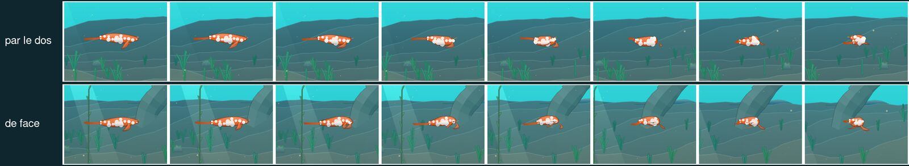
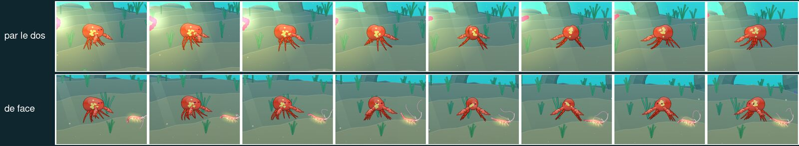
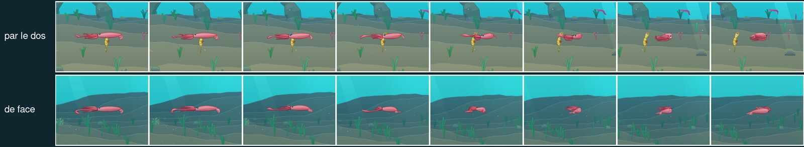

# Demi-tours aléatoires : par le dos ou de face

## Livré

Chaque demi-tour d'une créature (de droite à gauche, ou l'inverse) tire au sort le sens dans lequel il tourne :
- par le dos : la tête part vers le fond (+z), et on voit la créature de dos ;
- de face : la tête vient vers l'œil (−z), et on la voit de face.

Avant, la glisse et les jets passaient toujours par le fond, et la marche toujours de face.

- **`src/engine3/creature3.ts`**
  - `turnYaw(w)` (privée) : un seul ressort de cap pour les trois locomotions qui tournent (glisse, jets, marche).
    - Un demi-tour commencé à l'arrêt tire son sens (`turnWay`, ±1). Un demi-tour, c'est un écart de cap de plus de `HALF_TURN` = 1,6 rad, avec une vitesse de rotation sous 1 rad/s.
    - Il garde ce sens jusqu'à ce que le côté soit passé (écart < `HALF_TURN`).
    - Rappelé tôt en sens inverse (nouveau but à plus de 1 rad du but tiré), il revient par où il est venu, sans faire un tour complet.
  - `turnError(yaw, goal, way)` (exportée) : l'angle qui reste à tourner, le plus court ou celui du sens tiré.
  - Le cap `yaw` vit maintenant dans ]−π, π] ; « regarder à gauche » vaut ±π. Les bornes à [0, π] de la glisse et des jets disparaissent.
  - La cloche (méduses) ne tourne pas et reste inchangée. Le repos des jets en 3/4 (0,3 rad) aussi : par la face, leur demi-tour est un peu plus long (π + 0,6 au lieu de π − 0,6). Pour la marche, le demi-tour par le dos est le plus long (environ 240°), car le repos penche vers l'œil pour montrer les pattes.
- **`src/engine3/creature3.test.ts`** (nouveau), 7 tests :
  - `turnError` ;
  - un demi-tour dans chaque sens selon le tirage, sans saut, qui finit tourné de l'autre côté : poisson-clown (glisse), calmar (jets), crabe (marche) ;
  - les deux sens sur 30 demi-tours au hasard ;
  - le retour par où il est venu.
- `src/monde/main.ts` (`becomes`) et `src/editor/atelier.ts` (`rebuild`) : « tourné vers la gauche » se lit `Math.cos(yaw) < 0`, au lieu de `yaw > 1.57`, faux pour un cap négatif.
- `docs/direction-artistique.md` : une ligne dans « Ce qui existe déjà ».

**Comment le voir** : en jeu, nager à droite puis à gauche ; un demi-tour sur deux environ passe de face. Les captures ci-dessous ont été prises au ralenti (`monde.timeScale.v = 0.08`), avec le tirage forcé.

## Choix retenus

Aucune question posée à l'utilisateur (`ask.mjs`) : tous les choix sont tranchés par l'option recommandée.

| Question | Choix retenu | Pourquoi |
|---|---|---|
| Comment tirer le sens | 50/50 à chaque demi-tour (`Math.random`) | Ce que demande le chantier, simple, et sans état à garder |
| Qui est concerné | Tout ce qui tourne : glisse, jets, marche, pour le nageur comme pour les animaux | « les bestioles » : toutes ; la cloche n'a pas de profil |
| Comment faire le tour | Un seul ressort de cap sur un angle libre, qui garde le sens tiré jusqu'au côté | Le même code pour les trois locomotions ; continu, sans saut |
| Quand tirer | Seulement pour un demi-tour commencé à l'arrêt (écart > 1,6 rad) | Une consigne qui change en pleine rotation ne relance pas le tirage, donc pas de volte-face à contresens |
| Le repos en 3/4 des jets et de la marche | Gardé ; seul le chemin change | Les poses de repos avaient été réglées pour montrer les bras et les pattes |

## Options non retenues

- **Comment tirer le sens** :
  - une main propre à chaque individu (70/30 par exemple) : plus de caractère, mais moins visible et un réglage de plus ;
  - l'alternance : prévisible, donc mécanique ;
  - le côté qui a le plus de place (relief, premier plan) : plus juste, mais coûteux, et les collisions glissent déjà ;
  - un sens par espèce : trop régulier.
- **Qui est concerné** :
  - le nageur seulement : moins de vie dans la mer ;
  - la glisse seulement : les crabes ne passeraient jamais par le dos.
- **Comment faire le tour** :
  - un signe sur la composante z du cap (le plus court en code) : il retournait aussi la pose de repos en 3/4 des jets, dont les bras se seraient cachés derrière le manteau ;
  - un tour à part pour chaque locomotion : trois copies de la même logique.
- **Quand tirer** :
  - à tout changement de but au-delà du seuil : de petits écarts du but de la marche, en fin de rotation, pouvaient relancer le tirage et renvoyer la bête dans l'autre sens ;
  - un seuil plus haut (2 rad) : les crabes, dont le demi-tour vaut environ 2,06 rad, n'étaient plus tirés au sort dès qu'on les tirait un peu vers l'œil.
- **Le repos en 3/4** :
  - le symétriser, pour que les deux sens aient la même longueur : cela change des poses réglées ailleurs.

## Reste à faire / limites

- Le demi-tour par le dos d'un marcheur est long (environ 240°). Si c'est trop, on pourra baisser sa probabilité pour la marche seulement.
- Le tirage utilise `Math.random`, comme le reste du moteur (`rand`) : il n'est pas rejouable avec une graine.
- `make check` : le test `src/monde/nouveautes/plugin.test.ts` (« embeds the published versions only… ») échoue déjà sans ce chantier.
  - Le budget d'images de l'embarqué est rempli par v0.4.0 et v0.3.0, et les 8 entrées de v0.2.0 n'ont plus d'image.
  - Ce chantier ne touche ni `changes/v*`, ni `whatsNewPlugin.mjs`, ni ce test.

## Risques de fusion

- `src/engine3/creature3.ts` : `steerGlide`, `steerJet` et `steerCrawl` perdent chacune leurs 3 à 5 lignes de ressort de cap, remplacées par `this.turnYaw(w)`. S'y ajoutent `turnYaw`, `turnError` et `HALF_TURN`, plus le commentaire de `yaw`. Un conflit est possible avec un chantier qui toucherait ces lignes.
- `src/monde/main.ts` (`becomes`, une ligne) et `src/editor/atelier.ts` (`rebuild`, une ligne) : `yaw > 1.57` devient `Math.cos(yaw) < 0`.
- Du code nouveau qui lirait `yaw` en le supposant dans [0, π] se tromperait : il faut lire `Math.cos(yaw)`.
