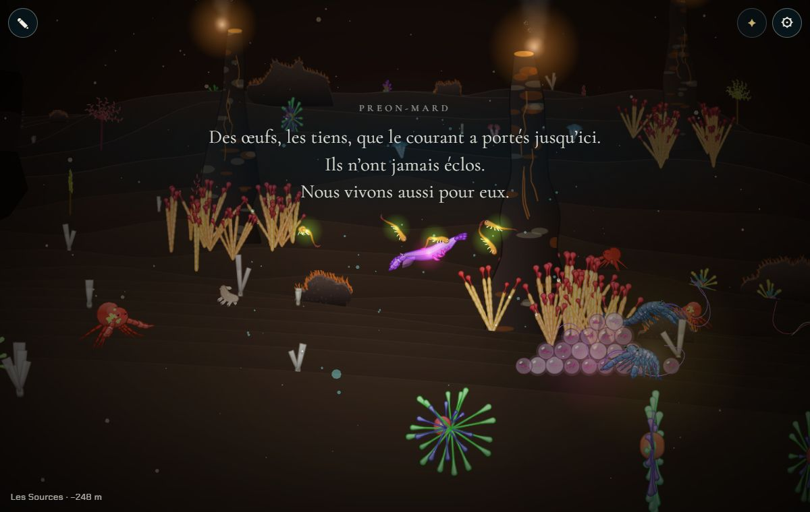
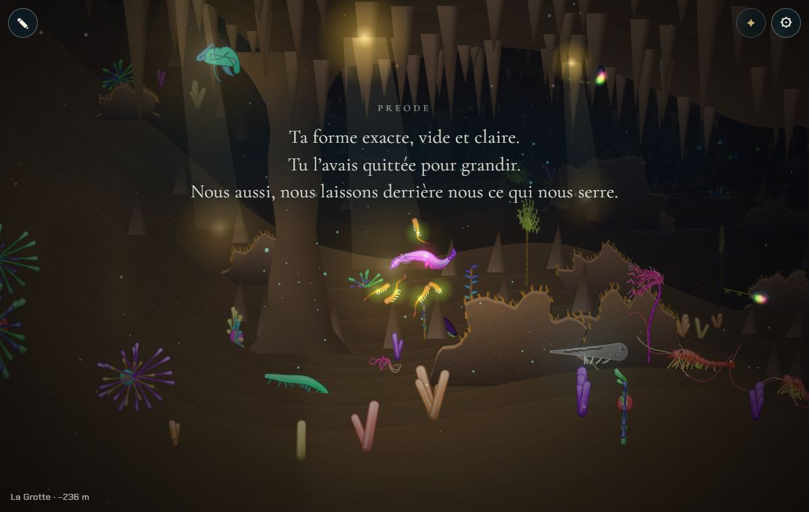
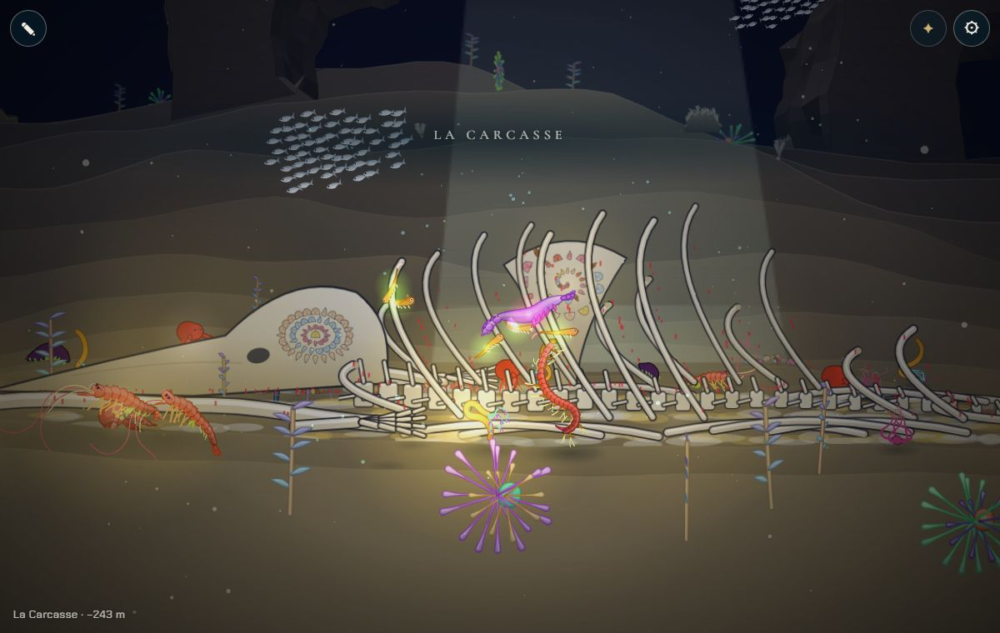
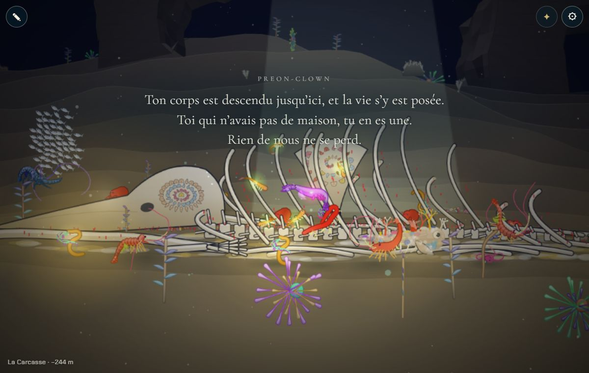
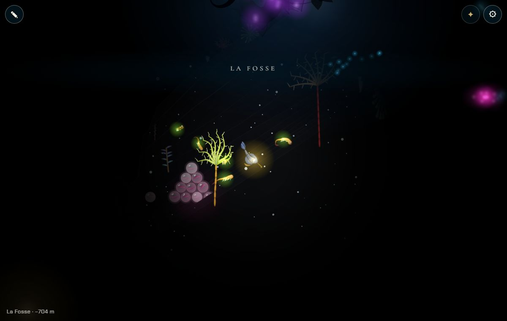

# Les traces de la lignée

## Livré

Plus bas dans la descente, chaque ancêtre de la partie sauvée laisse une trace, faite de son propre corps :

- **Qui, où** : chaque ancêtre de `partie.lineage` laisse une trace **deux chapitres plus bas** que celui où il a donné naissance. Le parent qu'on vient de quitter nage encore là où on l'a laissé ; c'est le grand-parent qu'on retrouve en arrivant. Rien avant la première naissance, rien sous le fond de la Fosse. Le Jardin n'a pas de fond : ce qui devait s'y poser tombe jusqu'à la Fosse.
- **Quoi** : à tour de rôle, par génération, les **œufs non éclos**, la **mue**, le **corps devenu récif**, puis de nouveau les œufs. Trois générations montrent les trois. Avec une naissance par chapitre : les œufs de la larve dans la Forêt, une mue dans la Grotte, un récif au pied de la baleine de la Carcasse, des œufs près des cheminées des Sources, une mue au bord du Glacier, puis le reste dans la Fosse.
- **À quoi elles ressemblent** : le corps de l'ancêtre, posé et dessiné une fois, puis transformé.
  - La mue est sa forme exacte, pâle et presque transparente : le contour et les coutures des parties tiennent, le reste laisse passer l'eau. Elle est fendue sur le dos, là où il en est sorti.
  - Le récif est son corps couché, blanchi comme les os de la baleine. Des coraux branchus, des anémones et des éponges poussent sur son dos, aux couleurs du Récif et du chapitre, jamais sur une antenne ou une nageoire fine. Des croûtes blanches et colorées le couvrent, et le sable le recouvre à moitié.
  - Les œufs sont un amas d'œufs clairs à sa couleur, rangés en rangs qui reposent dans les creux de ceux du dessous, deux roulés à l'écart. Dans chacun, sa petite forme recroquevillée ; certains sont devenus troubles.
  - La mue et le récif sont un peu plus grands que la lignée ne nage (×1,3 et ×1,5, au moins 80 et 110 de long) pour qu'on les voie de loin. Une méduse (nage en cloche) se couche sur le côté.
- **Sur le fond**, juste derrière le plan de nage (z de 8 à 20, devant les os les plus proches de la Carcasse), à une place fixe de leur chapitre qui ne bouge pas quand la lignée grandit, décalée si un relief ou une faille s'y trouve. Une petite lueur les signale dans le noir ; dans la Fosse, on ne les voit vraiment que dans sa propre lumière.
- **Les mots** : la première fois qu'on s'en approche (dans la session), la lignée dit le texte de cette trace, sous le nom de l'ancêtre, en lettres fines comme les ouvertures. La lueur de la trace s'avive le temps des mots, pour que l'œil la trouve. Les trois textes sont des propositions, écrits dans `docs/chapitres.md` (section « Les traces de la lignée ») :
  - les œufs : « Des œufs, les tiens, que le courant a portés jusqu'ici. Ils n'ont jamais éclos. Nous vivons aussi pour eux. »
  - la mue : « Ta forme exacte, vide et claire. Tu l'avais quittée pour grandir. Nous aussi, nous laissons derrière nous ce qui nous serre. »
  - le récif : « Ton corps est descendu jusqu'ici, et la vie s'y est posée. Toi qui n'avais pas de maison, tu en es une. Rien de nous ne se perd. » (il répond à l'ouverture du Récif)
- **Sans danger pour la narration** : rien ne se dit pendant un adieu ni par-dessus d'autres mots ; une ouverture de chapitre attend la fin des mots d'une trace, comme elle attend un adieu.
- **Coût** : chaque trace est dessinée une seule fois, à la première approche. C'est 3 à 13 ms sur PC pour les plus grandes espèces (méduse, seiche, dragon abyssal), avec lecture des pixels sur un canvas en mémoire. Ensuite, elle est seulement relavée par l'eau quand le brouillard change (moins de 0,5 ms).

Fichiers :

- `src/monde/traces.ts` : les règles pures.
  - `worldPlaces` : les chapitres où une trace peut se poser, jusqu'à leur obstacle.
  - `placeBelow` : deux chapitres plus bas, en passant les chapitres sans fond.
  - `tracesOf` : une trace par ancêtre, sa sorte, sa place.
  - `parseTraceTexts` : les mots.
- `src/monde/traces.test.ts` : 10 tests.
- `src/monde/traces-draw.ts` : le dessin des trois sortes.
- `src/monde/traces-jeu.ts` : dans le monde. Il suit la lignée (nouvelle disposition à chaque naissance, les dessins gardés), dessine avec la scène, met les lueurs et fait dire les mots.
- `src/monde/narration.ts` : `say(nom, lignes)`.
- `docs/mecaniques.md` : section « Les ancêtres ».
- `docs/chapitres.md` : les textes.

**Pour le voir** : il faut une lignée. Dans la console : `monde.partie.becomes(sp)`, puis `monde.partie.born(enfant, 'nurserie')`, `…born(enfant2, 'recif')`, etc. (des enfants faits par `fuse`). Ensuite, `monde.traces.list` donne chaque trace et sa position, et `monde.teleport(x - 170, y - 110)` y mène. `monde.skip.add('trace')` les cache, pour des captures avant / après.

## Choix retenus

Aucune question posée (consigne : trancher avec l'option recommandée). Un retour (feedback, `info`) signale au tableau de bord les deux points de contact avec « L'arbre de la lignée » et « Les ancêtres restent dans le monde ».

| Question | Choix retenu | Pourquoi |
| --- | --- | --- |
| Traces de qui | Des ancêtres de la partie sauvée (`partie.lineage`), une chacun | « Des traces de ta lignée » (mécaniques) : on doit reconnaître les siens ; la lignée sauvée existe déjà |
| Où | Deux chapitres sous celui de la naissance, sur le fond ; le Jardin sans fond les laisse tomber jusqu'à la Fosse ; rien sous la Fosse | « Plus bas », opposé à « en arrière » où le parent reste ; à deux chapitres, on trouve le grand-parent et pas le parent qu'on vient de quitter |
| Quelle sorte pour qui | À tour de rôle par génération : œufs, mue, récif | Les trois se voient dès trois générations ; les œufs de la larve d'abord (ses frères et sœurs qui ne sont jamais nés), le récif tombe à la Carcasse, chapitre du souvenir |
| À quoi elles ressemblent | Faites du corps de l'ancêtre (dessiné par le moteur, puis transformé) | On le reconnaît : c'est ce qui fait l'émotion |
| Taille | Mue ×1,3, récif ×1,5, avec une longueur minimale | À la taille réelle, la trace d'une petite génération disparaissait dans le décor (vérifié en captures) |
| Profondeur de pose | z de 8 à 20, derrière le plan de nage | À 28, la trace passait derrière la mâchoire de la baleine |
| Les mots | Une fois par session, à l'approche, sous le nom de l'ancêtre, textes dans `chapitres.md` | Le texte est la seule interface ; sans eux, une trace est un décor de plus ; les textes restent des données |
| Attirer l'œil | La lueur de la trace s'avive pendant les mots | Discret, sans flèche ni icône |
| Dans le noir | Une petite lueur additive ; la trace elle-même seulement dans la lumière du nageur | Règle de la Fosse : on ne voit que ce que sa lumière éclaire |
| Couleurs du récif | Celles du Récif, plus celles du chapitre | Un récif doit en avoir l'air même dans la Carcasse ivoire ; le lien avec le Récif, deuxième maison de la lignée |
| Coût | Dessin unique, relavé seulement | Le premier jet coûtait 15 à 40 ms à chaque changement de zoom |
| Narration | `say` dans `narration.ts`, une ouverture attend les mots d'une trace | Une ouverture effaçait les mots au même instant (vu en test) |

## Options non retenues

- **Traces de qui** :
  - des traces génériques d'anciennes générations, sans lien avec la sauvegarde : plus simple, mais on ne reconnaîtrait personne ;
  - seulement les trois traces du plan, une fois chacune : moins de présence dans la seconde moitié ;
  - des traces de la lignée rivale : c'est un autre chantier (et les fresques de la Carcasse en tiennent lieu).
- **Où** :
  - un chapitre plus bas : on croiserait la carcasse du parent qu'on vient de quitter, encore vivant juste au-dessus ;
  - trois chapitres plus bas : les premières traces n'arriveraient qu'à la Carcasse ;
  - dans le chapitre de la naissance, près du parent : contraire à « plus bas » ;
  - flottant dans le Jardin (œufs pélagiques, mue qui dérive) : joli, à faire ensuite, demande un placement en pleine eau et un léger mouvement.
- **Quelle sorte** :
  - selon le corps (une carapace mue, un grand corps devient récif, un petit laisse des œufs) : plus « juste », mais une lignée pourrait ne jamais montrer les trois ;
  - selon le chapitre (des œufs près des sources chaudes, une mue dans la glace) : plus décoratif, mais sans lien avec la génération ;
  - au hasard (graine) : imprévisible pour le même résultat.
- **Rendu** :
  - un squelette dessiné à part : les corps sont faits de fouets, pas d'os ; trop coûteux pour un rendu incertain ;
  - la créature vivante figée, dessinée à chaque image : coût par image, sans le blanchi ni la vie posée dessus ;
  - des silhouettes génériques : pas de reconnaissance.
- **Les mots** :
  - aucun texte : moins d'émotion, la trace passe inaperçue ;
  - à chaque passage : lassant ;
  - gardés dans la sauvegarde (dits une seule fois pour toujours) : cohérent aussi, mais les ouvertures se redisent à chaque session ; à décider ensemble.
- **Attirer l'œil** :
  - la caméra qui se tourne vers la trace (comme l'adieu) : plus fort mais prend la main ;
  - un scintillement permanent : bruyant dans les chapitres clairs.
- **Dans le noir** : faire luire la trace elle-même par-dessus le noir. Contraire à la Fosse, et il faudrait la dessiner après le noir.
- **Coût** : garder un dessin par niveau de zoom, comme les décors ; plus net, mais c'est lui qui coûtait cher.

## Reste à faire / limites

- **Les textes** sont des propositions, à relire comme les adieux.
- **Le nom** affiché est celui de l'espèce de l'ancêtre (`spec.name`). Si « L'arbre de la lignée » permet de nommer une génération, il faudra le lire dans `traces-jeu.ts` : c'est une ligne, `say(p.spec.name, …)`.
- **Avec « Les ancêtres restent dans le monde »** : un grand-parent vit là-haut et sa trace est plus bas. C'est voulu par le plan (« en arrière » / « plus bas »), mais à relire ensemble une fois les deux fusionnés.
- **Plusieurs traces peuvent tomber dans la Fosse** (les ancêtres du Glacier, du Jardin, et les naissances multiples) ; elles s'y écartent de 40 px au moins.
- **Mots redits à chaque session**, comme les ouvertures.
- **La Remontée** (étape 5) pourrait allumer les traces au passage ; rien n'est fait pour elle.
- **Pas de test automatique du dessin** (canvas) : vérifié en captures dans le Chrome Windows (GPU). La logique pure est testée.
- **Pas mesuré sur un vrai téléphone** : sur PC, 3 à 13 ms une fois par trace et par session.
- **Hors chantier** : le test `src/monde/nouveautes/plugin.test.ts` (« embeds the published versions only… », ligne 71) échoue déjà sans mes changements. Depuis la version 0.4.0, le budget de 400 Ko des images embarquées ne couvre plus celles de la 0.2, qui passent après les versions récentes. Je ne l'ai pas touché : c'est `make check` qui le signale.

## Risques de fusion

- `src/monde/main.ts` : des branchements courts, sans autre changement.
  - un import ;
  - `traces.step(px, py)` à la fin de `update` ;
  - `traces.items(…)` après `pushReliefs` dans `render` ;
  - `const traces = initTraces(…)` après `initAdieu` ;
  - `traces` dans `api`.
- `src/monde/narration.ts` :
  - la méthode `say` et la sorte de texte `'trace'` ;
  - la condition de `farewellUntil`, qui compte aussi les mots d'une trace.
- `docs/chapitres.md` : une nouvelle section « Les traces de la lignée », avant « Dans le monde ».
- `docs/mecaniques.md` : des puces sous « Les ancêtres ». Le voisin « Les ancêtres restent dans le monde » écrira probablement dans la même section : garder les deux.
- `partie.ts` n'est pas touché : je ne lis que `creature` et `chapter` de chaque ancêtre, ce qui reste compatible si un voisin ajoute des champs (position, nom, partenaire).
- **La lignée rivale de la Carcasse** : le récif de la 3ᵉ génération se pose à la Carcasse (x ≈ 14 640, z 8 à 20, devant les côtes). Si la lignée rivale y met un décor fixe, vérifier qu'ils ne se couvrent pas.
