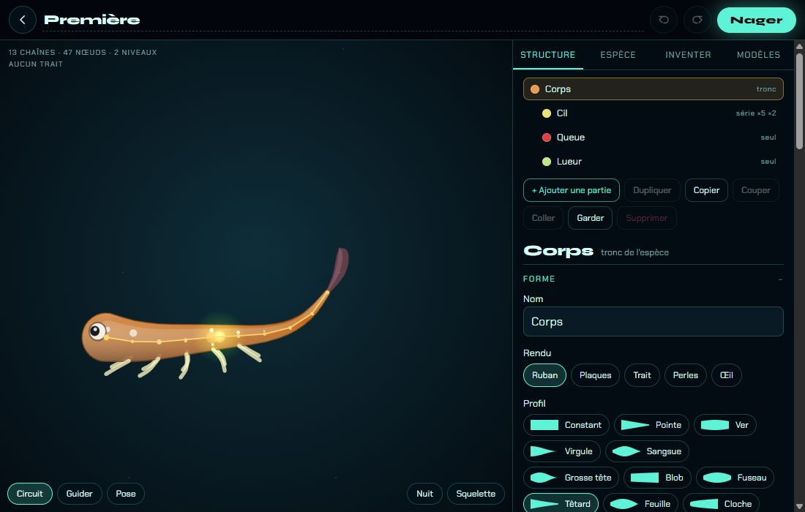
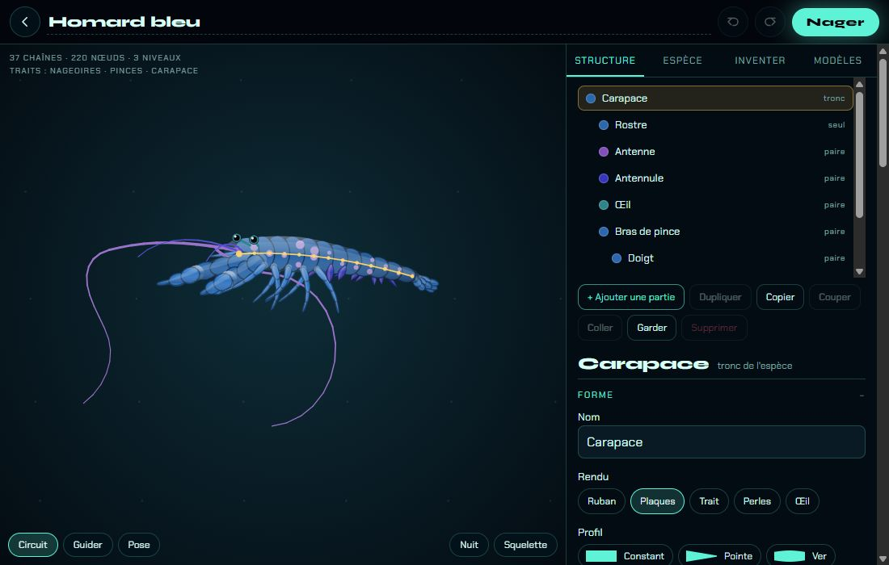
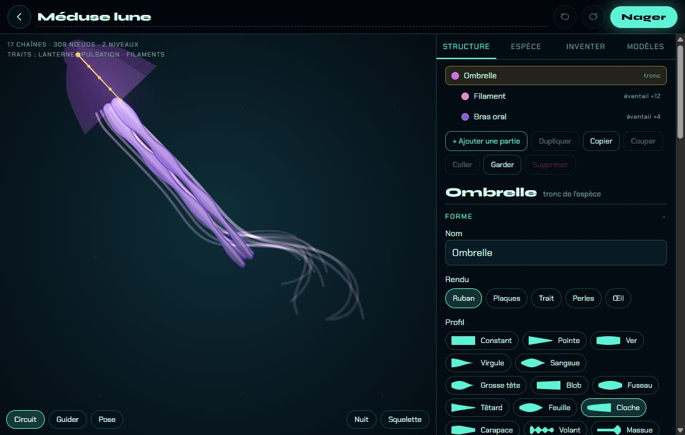

# Les traits du corps

## Livré

- **`src/content/traits.ts`** : fonction pure `traitsOf(sp: Spec): Trait[]` (ordre fixe de `TRAITS`, sans doublon), `hasTrait`, `TRAIT_LABELS` (libellés français), `TRAIT_THRESHOLDS`, `bodyMeasures(sp)` (finesse du tronc, part de surface en plaques, ampleur de la pulsation). Les 8 traits de la table de `docs/mecaniques.md` : `nageoires`, `lanterne`, `pinces`, `corpsFin`, `carapace`, `pulsation`, `filaments`, `cils`.
- Les traits se lisent sur le **rôle, le style et la forme** des parties, jamais sur leur nom (les espèces renomment les parties : « Aile » du clione, « Mâchoire » du grand gosier…). Ça marche donc aussi sur les enfants de `fuse` et les espèces de `generate`.
- **Ébauches** : champ optionnel `bud?: boolean` sur `NodeDef` (`src/engine/types.ts`) ; une ébauche n'apporte aucun trait (ce qui pousse dessus, si). Posé sur la queue, la lueur et les cils de `firstAncestor` : la génération 1 naît sans trait, comme le veut `chapitres.md`, sans rien changer à son image.
- **Atelier** : une ligne « Traits : … » (ou « Aucun trait ») sous le compteur de chaînes, mise à jour à chaque modification (`src/editor/atelier.ts`, `dom.ts`, `atelier.css`).
- **Tests** : `src/content/traits.test.ts` (12 tests) : chaque trait sur les espèces d'où il vient, les lignes des seuils, les noms ignorés, les ébauches, les espèces générées et fusionnées, la pureté.
- **Doc** : la table de `docs/mecaniques.md` dit maintenant la règle exacte et les seuils.

### Les traits du bestiaire

| Espèce | Traits |
| --- | --- |
| anguille | nageoires, corpsFin, filaments |
| meduse | lanterne, pulsation, filaments |
| crevette | nageoires, carapace |
| calmar | nageoires, filaments |
| baudroie | nageoires, lanterne |
| nudibranche | lanterne |
| plumeau | corpsFin, carapace, filaments |
| larve | — |
| serpentCilie | corpsFin, cils |
| hydre | lanterne, pinces, carapace, filaments |
| meduseBoite | lanterne, pulsation, filaments |
| physalie | filaments |
| anemone | filaments |
| chrysaora | pulsation, filaments |
| siphonophore | nageoires, lanterne, corpsFin, pulsation, filaments |
| ctenophore | lanterne, filaments, cils |
| homard | nageoires, pinces, carapace |
| crabe | pinces, carapace |
| krill | nageoires, lanterne, carapace |
| crevetteMante | nageoires, pinces, carapace |
| copepode | nageoires, lanterne, carapace, cils |
| poulpe | filaments |
| nautile | carapace, filaments |
| clione | nageoires, lanterne |
| seiche | nageoires, filaments |
| poissonLion | nageoires |
| manta | nageoires, filaments |
| hippocampe | nageoires, carapace |
| poissonClown | nageoires |
| dragonFeuillu | corpsFin |
| combattant | nageoires |
| grandGosier | lanterne, pinces, filaments |
| requinBaleine | nageoires |
| koi | nageoires |
| verDeFeu | corpsFin, carapace |
| verPlat | nageoires |
| etoile | — |
| ophiure | carapace, filaments |
| oursin | — |
| axolotl | nageoires |
| tortue | nageoires |
| tardigrade | carapace |
| dragonAbyssal | nageoires, lanterne, corpsFin |
| firstAncestor | — (ébauches) |

## Choix retenus

| Question | Choix retenu | Pourquoi |
| --- | --- | --- |
| La larve de départ « sans trait » alors qu'elle a queue, lueur et cils | **Ébauches** (`bud: true`) — choix de l'**utilisateur** (question posée sur le tableau de bord) | Aucun seuil de taille ne la sépare des autres ; rien ne change à l'image |
| Où vit la fonction | `src/content/traits.ts` (auto) | C'est une règle sur le bestiaire ; les voisins l'importent directement ; `content/index.ts` pas touché |
| Forme du résultat | `Trait[]` dans l'ordre de `TRAITS` (auto) | Stable pour l'affichage et les tests ; `new Set(...)` au besoin |
| Reconnaître une partie | par rôle, style, forme (auto) | Les noms sont renommés par les espèces et l'Atelier |
| Corps fin | longueur du tronc ≥ **15** × son plus grand rayon (auto) | Écart net dans le bestiaire : anguille 18,7 contre larve 12,2, axolotl 12, homard 11,1 |
| Carapace | ≥ **40 %** de la surface de l'animal en `plates` (auto) | Le crabe (tronc lisse, pattes et pinces en plaques) l'a ; le dragon feuillu (23 %) non ; plus bas cas retenu : hydre 45 %, copépode 43 % |
| Pulsation | nage `bell`, ou tronc `pulse` d'ampleur ≥ **0,15** (auto) | Les méduses battent à 0,16–0,22, le manteau du calmar à 0,1 |
| Nageoires | toute partie de rôle `fin` (auto) | La table ; les pléopodes et l'éventail des crustacés comptent (les crevettes nagent) |
| Lanterne | rôle `light` ou toute lueur `color.glow` (auto) | La table (« toute lueur ») |
| Pinces | rôle `jaw` **en plaques** (auto) | Exclut la tête de la tortue (rôle `jaw`, en ruban) |
| Filaments | partie `whip`/`sting`/`deco` d'au moins 8 maillons et `flex` ≥ 0,3 (auto) | Garde filaments, tentacules, bras oraux, bras du poulpe ; exclut piquants et épines raides |
| Rendre visible | ligne de traits dans l'Atelier (auto) | Voir les seuils agir en éditant ; l'écran de la portée les montrera aux joueurs |

## Options non retenues

- **Larve sans trait** : seuils de taille par trait (pas de champ nouveau, mais fragiles : ils retiraient aussi des traits à l'hippocampe, l'axolotl, le copépode, le krill) ; retoucher la larve (rôles `deco`, sans lueur : change son allure, le rôle oriente la partie dans le moteur) ; lui laisser ses 3 traits et corriger `chapitres.md` (les premiers obstacles ne barreraient plus rien).
- **Emplacement** : `src/engine/traits.ts` (le moteur ne connaît pas les règles de jeu) ; `src/monde/` (l'Atelier et la portée en ont aussi besoin).
- **Résultat** : `Set<Trait>` (pas d'ordre d'affichage) ; un score par trait de 0 à 1 (utile pour la parade/portée, plus tard ; `bodyMeasures` en donne déjà la base).
- **Reconnaissance par nom de partie** (`nageoire`, `pince`…) : les parties ne gardent pas leur id, et les noms changent.
- **Corps fin** : seuil sur la largeur absolue (un grand gosier fin mais énorme passerait ; à ajouter si un obstacle doit aussi être « étroit ») ; seuil 12 (l'axolotl et la larve basculeraient).
- **Carapace** : « tronc en plates » seul (le crabe la perdrait) ; compter le tronc seul avec les pinces (plus compliqué, même résultat).
- **Pulsation** : toute nage `jet` (poulpe, calmar, nautile) : elles montent aussi, mais la table parle des méduses.
- **Lanterne** : seulement le rôle `light` ou la lueur du corps entier (les méduses et le cténophore la garderaient, le nudibranche et la baudroie non) — moins fidèle à la table.
- **Nageoires** : exclure les pléopodes et l'éventail des crustacés (plus « poisson », mais contredit leur rôle `fin` et leur nage).

## Reste à faire / limites

- La **tortue** n'a pas de carapace : son tronc « Carapace » est dessiné en ruban. Passer son style en `plates` la lui donnerait (changement d'allure, à décider).
- **Aucun trait** pour la larve, l'étoile de mer et l'oursin : à garder en tête pour les partenaires (chantier des espèces compatibles).
- `bud` n'est pas éditable dans l'Atelier (il se conserve dans les sauvegardes et les fusions) ; une case « ébauche » serait facile à ajouter.
- Les enfants de la larve gardent ses ébauches : ils ne gagnent un trait que par le partenaire (ou par un tronc fusionné qui franchit un seuil).
- Les voisins (obstacles-clés, espèces compatibles, portée) ont reçu l'API et la table ; obstacles-clés a un remplaçant provisoire `src/monde/obstacles-traits.ts` à rediriger vers `traitsOf` à la fusion.

## Risques de fusion

- `src/engine/types.ts` : un champ optionnel `bud?: boolean` dans `NodeDef` (additif).
- `src/content/species.ts` : `bud: true` sur 3 parties de `firstAncestor` et son commentaire.
- `src/editor/atelier.ts` (un import, 2 lignes dans `renderMeter`), `dom.ts` (un ``), `atelier.css` (une règle).
- `docs/mecaniques.md` : la table des traits réécrite (colonne « Dans le code ») et un paragraphe.
- Nouveaux : `src/content/traits.ts`, `src/content/traits.test.ts`.
