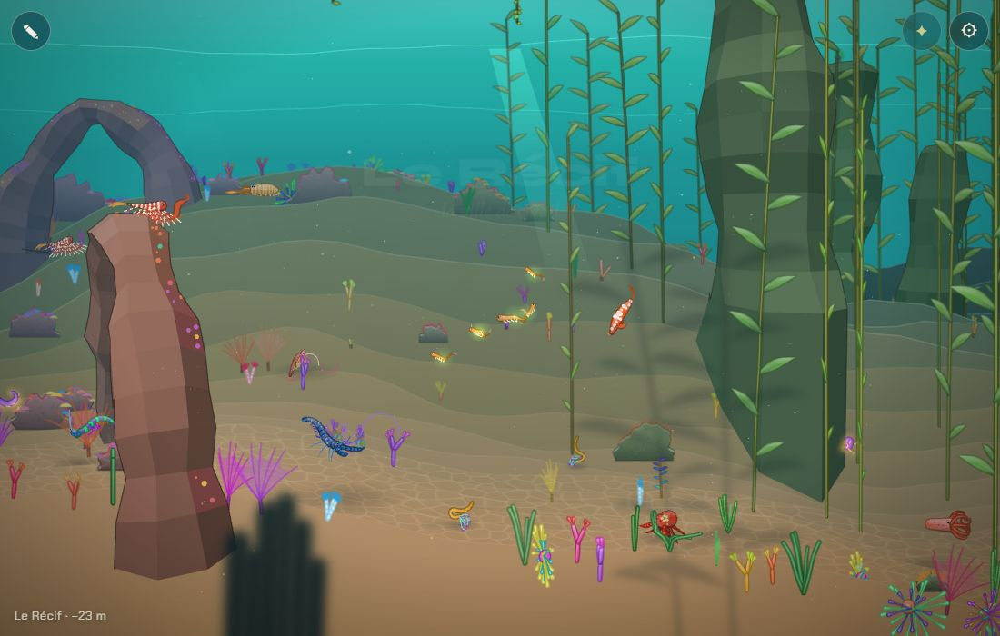
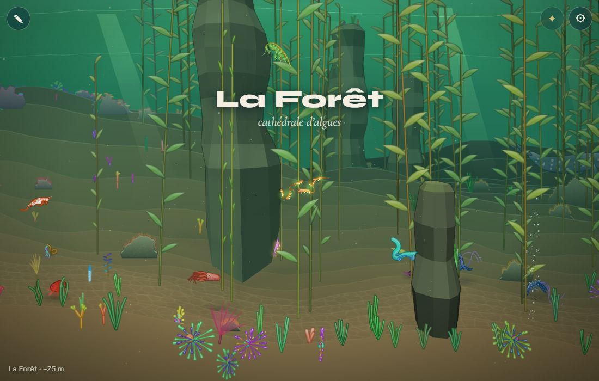

# Les transitions entre chapitres

## Livré

- La lumière et la couleur de l'eau se fondaient déjà sur 1 400 px (`moodAt`) ; les plantes aussi (`ownerAt`). Il manquait **la faune** et **le moment du titre**.
- `src/monde/transitions.ts` (nouveau) :
  - `faunaX(bi, R)` : place les animaux d'un chapitre sur tout son span **et** jusqu'à 700 px au-delà de chaque frontière, avec la même pondération que la lumière (`presence`). Avant, ils restaient à 200 px en retrait de la ligne : un vide, puis un changement net.
  - `ChapterWatch` : le titre s'affiche quand la nouvelle lumière a gagné à 85 % (≈ 500 px après la ligne, au lieu de 150 px), sans répétition quand on fait l'aller-retour sur une frontière ; `jump()` l'annonce tout de suite après un voyage (`gotoBiome`) ou au début.
- `src/monde/transitions.test.ts` : répartition de la faune autour des frontières ; moment du titre et absence de répétition.
- `docs/chapitres.md` : section « Le passage d'un chapitre à l'autre ».
- Pour voir : nager du Récif vers la Forêt (ou `monde.teleport(x, 400)` autour de `monde.biomes[2].x0`).

## Choix retenus

| Question | Choix retenu | Pourquoi |
|---|---|---|
| Comment mêler la faune | Même bande et même pondération que la lumière (`presence`) | Cohérent avec plantes et décors, zéro coût à l'exécution |
| Quand montrer le titre | Quand la nouvelle lumière a gagné à 85 % | Le titre arrive « dans » le chapitre, pas sur la ligne |
| Aller-retour sur une frontière | Pas de nouveau titre pour le chapitre qu'on vient de quitter | Évite le clignotement des titres |
| Largeur du fondu de lumière | Inchangée (1 400 px) | Déjà progressive ; les tests et la carte des voisins en dépendent |

Aucune question posée à l'utilisateur (tout `auto`).

## Options non retenues

- Faune : faire migrer les animaux en temps réel vers leur chapitre (vivant, mais coûteux et touche la boucle de `main.ts`) ; espèces « de passage » dédiées aux frontières (demande du contenu par frontière).
- Titre : à la ligne exacte (trop tôt, la lumière n'a pas changé) ; au milieu du chapitre (trop tard) ; attendre que le joueur ralentisse (imprévisible) ; ne jamais le remontrer après la première visite (on perd le repère en revenant de loin).
- Fondu : l'élargir à 2 000–3 000 px (plus doux, mais dilue les chapitres courts et casse des tests des voisins) ; largeur par frontière (plus fin, plus de réglages).

## Reste à faire / limites

- Le texte d'ouverture (plusieurs lignes, voix du « nous ») est le chantier `textes-narratifs` : il peut se brancher sur `ChapterWatch.step` pour arriver au même moment.
- Les bancs de poissons et les grands visiteurs restent dans leur chapitre.
- Le son d'ambiance, quand il existera, devrait suivre `presence` de la même façon.

## Risques de fusion

- `src/monde/main.ts` : 5 branchements courts (import, placement de la faune, entrée dans un biome, `gotoBiome`, titre du début) ; la variable `here` disparaît au profit de `chapters`.
- `src/monde/biomes.ts` : `BLEND` exporté (un mot).
- `docs/chapitres.md` : une section ajoutée avant « Les textes ».
