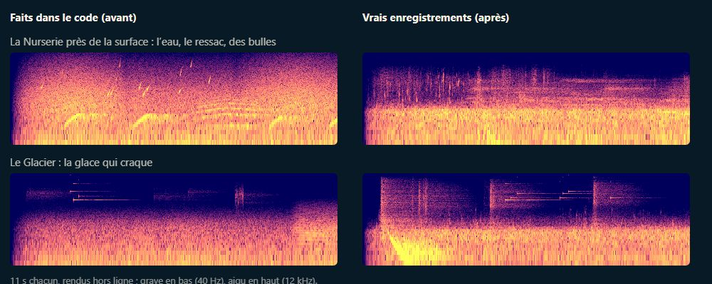
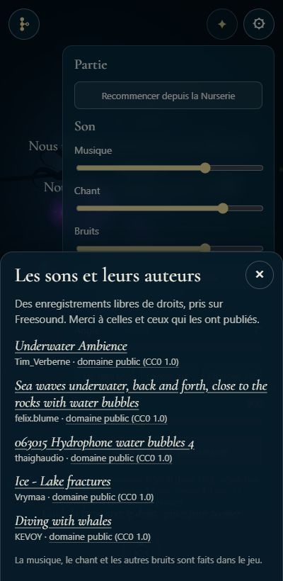
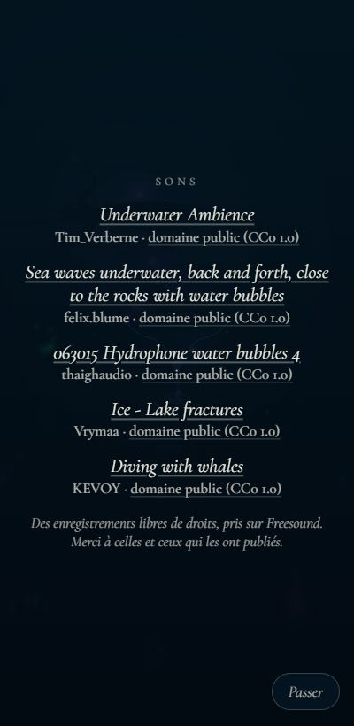

# De vrais sons pour l'ambiance (et leurs crédits)

## Livré

**Le chantier : de vrais enregistrements pour l'ambiance** (commit `20c8a9a`)

- Cinq enregistrements de Freesound, tous en **CC0**, dans `src/monde/sons/` avec leur fichier de crédits `credits.json` (titre, auteur, licence, lien vers la source, extrait gardé, rôle dans le jeu) :

  | Fichier | Son d'origine | Auteur | Rôle | Poids |
  | --- | --- | --- | --- | --- |
  | `eau.mp3` | Underwater Ambience.wav (hydrophone + bruit filtré) | Tim_Verberne | l'eau qui respire, en boucle | 45 Ko |
  | `ressac.mp3` | Sea waves underwater, back and forth, close to the rocks… | felix.blume | le ressac près de la surface, en boucle | 42 Ko |
  | `bulles.mp3` | 063015 Hydrophone water bubbles 4.wav | thaighaudio | les bulles çà et là, suintements et cheminées | 53 Ko |
  | `glace.mp3` | Ice - Lake fractures (lac gelé, sous l'eau) | Vrymaa | la glace du Glacier qui craque | 75 Ko |
  | `baleines.mp3` | Diving with whales.wav (Polynésie) | KEVOY | les baleines au loin, les cris des grands visiteurs | 80 Ko |

  295 Ko en tout, 393 Ko une fois embarqués en base64 (budget de 400 Ko, vérifié par un test).
- `src/monde/enregistrements.ts` (pur, testé) : le rôle de chaque fichier (`RECS`), la boucle sans couture (`loopable` : enlève le silence que le décodeur ajoute aux bouts, puis fond la fin dans le début à puissance égale), le repérage des bruits d'un fichier qui en tient plusieurs (`cues` : là où le son monte au-dessus du calme du fichier), la lecture des crédits (`parseCredits`, licences CC0 et CC BY seulement).
- `src/monde/enregistrements-son.ts` : les fichiers (une URL `data:` dans la page publiée, un fichier servi en dev, `import.meta.glob`), décodés **après le premier toucher** seulement (le moteur des bruits naît au réveil du son), un à un dans l'ordre `LOAD_ORDER`, gardés décodés par contexte audio. Base64 lu sans `fetch` (pas de souci de CSP dans le lien Artifact). Un fichier que le navigateur ne sait pas lire est laissé : le son fait dans le code reste.
- `src/monde/bruits-son.ts` (branchements courts) :
  - **l'eau** et **le ressac** : une source en boucle et un filtre chacun, au même niveau que le bruit qu'ils remplacent ; le bruit généré s'efface puis est débranché 3 s après ;
  - **bulles**, **glace**, **baleines** : un bruit du fichier au hasard (`recCue`), passé par `way()` (côté, distance, réverbération) comme les autres ; les bulles à la hauteur de leur taille (celles des cheminées plus graves), les baleines selon leur voix (`farWhale` rend maintenant `voice`, et le second cri d'un grand visiteur est un peu plus bas) ;
  - `renderBruits(…, { recordings: false })` pour comparer ; `monde.bruits.heardRec` et `monde.bruits.recorded` pour les tests.
- Les niveaux, mesurés hors ligne dans Chrome (médiane / 95 % / max, en dB) : le fond reste vers −35 dB comme avant (Nurserie −35,2 au lieu de −35,5 ; Récif −34,8 au lieu de −35,2) ; une baleine de la Fosse culmine à −33,5 (−33,3 avant). La glace a été remontée jusqu'à se détacher du fond (ses craquements sont longs et sonnent plus fort que leur niveau moyen).
- Docs : `docs/decisions.md` (la décision « sans fichier audio » revue : formats, budget, chargement, cache, repli), `docs/direction-artistique.md` (« Les vrais enregistrements », ce qui reste généré et pourquoi, le coût).

**La sous-tâche : les crédits des sons** (commit `7b273c3`)

- `src/monde/credits-sons.ts` et `credits-sons.css` : la liste (titre lié à sa source, auteur, licence liée à son texte), lue dans `credits.json` (`SOUND_CREDITS`, `creditWords` : le titre sans l'extension du fichier, « domaine public (CC0 1.0) »).
- **Le générique** : une section « Sons » après la lignée, avant « La Lignée » (`generique-ecran.ts`, une ligne).
- **Le panneau ⚙** : section « Son », bouton « Les sons et leurs auteurs » (`index.html`, `son-reglages.ts`) qui ouvre une feuille comme celle des Nouveautés (Échap, ×, ou un toucher à côté pour fermer).
- Tests (`enregistrements.test.ts`) : chaque fichier audio de `src/monde/sons/` a sa ligne dans les crédits que montre le jeu, et chaque ligne son fichier ; chaque ligne a titre, auteur, licence libre et liens.
- Docs : `docs/mecaniques.md` (le générique), `docs/direction-artistique.md` (les crédits des sons).

 

**Pour l'entendre** : `make up`, toucher l'écran une fois, nager près de la surface de la Nurserie (le ressac), aller au Glacier (`monde.gotoBiome(6)`) ; `monde.bruits.play('whales')`, `play('bubbles')`, `play('cracks')` ; `monde.bruits.heardRec` compte ce qui a été joué depuis les fichiers.

## Choix retenus

| Question | Choix retenu | Pourquoi |
| --- | --- | --- |
| Où vivent les fichiers ? (posée sur le tableau de bord) | **Embarqués dans la page, budget de 400 Ko** — choix de l'utilisateur | marche partout (lien Artifact, fichier seul, hors ligne) ; la page reste un seul fichier |
| Format | MP3 mono, 24 à 40 kb/s, 24 à 48 kHz selon le son | le seul format que décodent tous les navigateurs (Safari d'iPhone compris) ; l'eau et le ressac, filtrés dans le jeu, n'ont pas besoin des aigus |
| Banque de sons | Freesound, CC0 seulement (CC BY accepté par le code) | pas d'obligation de mention, mais on nomme quand même tout le monde |
| Quels sons remplacer | l'eau, le ressac, les bulles, la glace, les baleines (et les cris des grands visiteurs) | ceux du chantier ; le reste suit le jeu ou la musique (vitesse, courant, cheminées, Grotte, cristaux sur les notes du chant) |
| Remplacer ou mêler | remplacer, le son du code en repli tant que le fichier n'est pas prêt | mêler gardait le son « électronique » qu'on voulait enlever |
| Boucles sans couture | fondu fin → début calculé dans le jeu après décodage | le silence ajouté par l'encodeur MP3 varie d'un décodeur à l'autre ; un fondu fait d'avance ne tomberait pas juste |
| Plusieurs bruits par fichier | repérés dans le jeu (`cues`), pas de liste de repères dans les crédits | moins de données à tenir à jour ; marche pour tout fichier ajouté |
| Chargement | après le premier toucher, un à un, gardés décodés | rien avant que la page ait le droit de sonner ; aucune attente pour le joueur |
| Crédits dans le jeu | générique + feuille ouverte depuis ⚙ « Son » | demandé par la sous-tâche ; la feuille reprend le style des Nouveautés |
| Titres affichés | le titre Freesound sans l'extension (« .wav ») | plus lisible ; le lien mène au titre exact |

## Options non retenues

- **Où vivent les fichiers** : à côté de la page (`play/sons/`), chargés après le premier toucher — page légère, mais pas de vrais sons dans le lien Artifact ni dans le fichier seul, et la publication doit copier un dossier ; mixte (eau et ressac embarqués, le reste à côté) — les sons rares absents dans l'Artifact, deux chemins de chargement.
- **Format** : Opus (Ogg ou WebM) — deux fois plus léger à qualité égale, mais Safari ne le décode pas partout ; AAC (ADTS ou M4A) — bon partout, mais l'encodeur de Chrome sous Windows ne descend pas sous 96 kb/s ; WAV — dix fois plus lourd.
- **Banque** : sons de la NOAA (domaine public, vraies baleines) — très bons, mais à chercher ailleurs que Freesound, à refaire si on veut plus de variété ; les enregistrements CC BY de baleines (alanmcki, ETH Zürich) — plus de variété de chants, au prix d'une mention obligatoire et de 60 à 80 Ko de plus.
- **Remplacer ou mêler** : mêler vrai et généré pour plus de variété — garde l'effet électronique ; remplacer aussi les gouttes de la Grotte et les cristaux — les gouttes générées sonnent juste, les cristaux suivent les notes du chant.
- **Boucles** : deux sources qui se relaient avec des fondus programmés — robuste aussi, mais deux voix par fond et une horloge de plus ; fondu fait à la préparation — tombe faux selon le décodeur.
- **Repères** : une liste de repères (début, durée) par fichier dans `credits.json` — exact, mais à refaire à chaque nouveau fichier.
- **Chargement** : tout décoder dès l'ouverture de la page — interdit avant le premier toucher sur certains navigateurs, et inutile tant que la page est muette ; décoder à la demande, chapitre par chapitre — moins de mémoire, mais un premier bruit en retard à chaque nouveau chapitre.
- **Crédits** : une page à part (un lien) — sort du jeu ; seulement dans le générique — invisible avant la fin de l'histoire.

## Reste à faire / limites

- **Je n'ai pas pu écouter** : les extraits sont choisis sur spectrogrammes et sur l'enveloppe de chaque fichier, les niveaux réglés par mesure hors ligne. Une écoute au casque et sur un haut-parleur de téléphone est à faire, surtout la glace (remontée de 9 dB par rapport au premier réglage) et les baleines (le fond de mer de leur enregistrement est assez présent, tout part presque dans la réverbération).
- Pas encore vérifié sur un vrai iPhone (décodage MP3 attendu partout ; sinon le son du code reste).
- Mémoire : une fois décodés, environ 14 Mo (le contexte audio les met à 48 kHz).
- Poids : la page compilée passe de 1,19 Mo à 1,59 Mo (le budget de 400 Ko est presque plein : 393 Ko). Pour ajouter un son, il faudra en raccourcir un autre, relever le budget, ou passer à Opus le jour où Safari le lit partout.
- Préparation des fichiers (hors du dépôt, notée ici pour la refaire) : préécoutes `-hq.mp3` de Freesound, découpe, passage en mono et rééchantillonnage dans Chrome (`OfflineAudioContext`), normalisation à −1 dBFS, encodage par LAME (`pip install --user lameenc`, hors npm). Les extraits exacts sont dans `credits.json`.
- Les cris des grands visiteurs (raie manta, tortue…) sont maintenant des baleines enregistrées, plus ou moins aiguës selon leur taille : à juger à l'écoute.
- Pour le chantier « La distance des sons » (lancé en même temps) : les bruits enregistrés passent par `way()` et `heard()` comme les autres, ils suivront ses réglages ; les fonds (eau, ressac) n'ont pas de position.

## Risques de fusion

- `src/monde/bruits-son.ts` (partagé avec **distance-sons**, **coupures du son**) : nouveaux paramètres `recs` de `bruitsEngine` et `voice`, `apart` de `whale()`, un bloc au début de `bubbles()`, `ice()` et `whale()`, des champs dans `Beds`, trois lignes dans `tick()` (les gains de l'eau et du ressac), l'option `recordings` de `renderBruits`, deux accesseurs. Si un voisin réécrit `bubbles()` ou `way()`, garder le bloc « real » en tête de fonction.
- `src/monde/bruits.ts` : `farWhale` rend aussi `voice` (même ordre de tirages au hasard).
- `src/monde/generique-ecran.ts` : un import et une ligne (`list.append(soundsSection())`).
- `index.html` : un bouton sous le curseur « Bruits » ; `src/monde/son-reglages.ts` : un import et une ligne.
- Docs : `decisions.md` (puce « Son »), `direction-artistique.md` (« Le son »), `mecaniques.md` (le générique) — ajouts.
